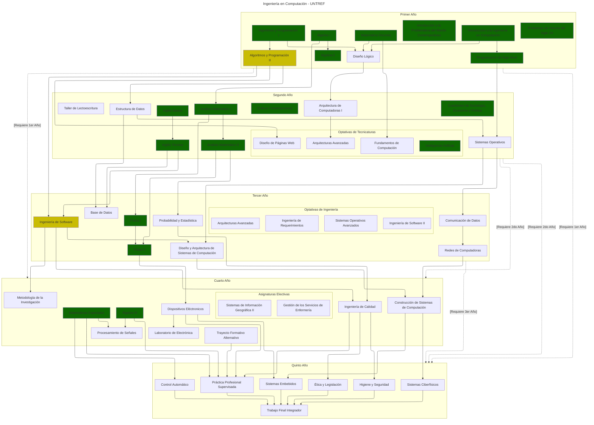

# Plan de Estudios
Ingeniería en Computación UNTREF, Plan 2022

```mermaid
---
config:
  layout: elk
title: Ingeniería en Computación - UNTREF
---
flowchart TD
 subgraph a1["Primer Año"]
        id591["Problemas de Historia del Siglo XX"]
        id592["Introducción a la Problemática del Mundo Contemporáneo"]
        id1700["Introducción a la Ingeniería en Computación"]
        id1701["Algoritmos y Programación I"]
        id1702["Álgebra I"]
        id1703["Matemática Discreta"]
        id1704["Algoritmos y Programación II"]
        id1705["Álgebra II"]
        id1706["Diseño Lógico"]
        id1707["Programación de Bajo Nivel"]
  end
 subgraph subGraph1["Optativas de Tecnicaturas"]
        id1243["Fundamentos de Computación"]
        id1739["Diseño de Páginas Web"]
        id1849["Arquitecturas Avanzadas"]
        id1850["Inteligencia Artificial"]
  end
 subgraph a2["Segundo Año"]
        id2["Cultura Contemporánea"]
        id3["Cuestiones de Sociología, Economía y Política"]
        id1708["Análisis Matemático I"]
        id1709["Estructura de Datos"]
        id1710["Arquitectura de Computadoras I"]
        id1711["Análisis Matemático II"]
        id1714["Taller de Lectoescritura"]
        id1715["Sistemas Operativos"]
        id1737["Inglés Básico"]
        id1738["Inglés Técnico"]
        subGraph1
  end
 subgraph subGraph3["Optativas de Ingeniería"]
        id1258["Ingeniería de Requerimientos"]
        id1741["Sistemas Operativos Avanzados"]
        id1874["Arquitecturas Avanzadas"]
        id1875["Ingeniería de Software II"]
  end
 subgraph a3["Tercer Año"]
        id1713["Física I"]
        id1716["Probabilidad y Estadística"]
        id1717["Base de Datos"]
        id1718["Ingeniería de Software"]
        id1719["Física II"]
        id1720["Comunicación de Datos"]
        id1721["Diseño y Arquitectura de Sistemas de Computación"]
        id1724["Redes de Computadoras"]
        subGraph3
  end
 subgraph subGraph5["Asignaturas Electivas"]
        id700["Sistemas de Información Geográfica II"]
        id1480["Gestión de los Servicios de Enfermería"]
  end
 subgraph a4["Cuarto Año"]
        id1["Metodología de la Investigación"]
        id1712["Álgebra III"]
        id1722["Matemáticas Especiales"]
        id1723["Dispositivos Eléctronicos"]
        id1725["Trayecto Formativo Alternativo"]
        id1726["Ingeniería de Calidad"]
        id1727["Laboratorio de Electrónica"]
        id1728["Construcción de Sistemas de Computación"]
        id1729["Procesamiento de Señales"]
        subGraph5
  end
 subgraph a5["Quinto Año"]
        id1730["Sistemas Embebidos"]
        id1731["Sistemas Ciberfísicos"]
        id1732["Control Automático"]
        id1733["Ética y Legislación"]
        id1734["Higiene y Seguridad"]
        id1735["Trabajo Final Integrador"]
        id1736["Práctica Profesional Supervisada"]
  end
    id1709 --> id1717 & id1715
    id1738 --> id1717 & id1718
    id1711 --> id1716 & id1719
    id1707 --> id1715
    id1708 --> id1713 & id1711
    id1713 --> id1719
    id1702 --> id1708 & id1705
    id1706 --> id1710
    id1704 --> id1709 & id1718 & id1739
    id1700 --> id1707 & id1706
    id1701 --> id1706 & id1704
    id1703 --> id1706 & id1243
    id1720 --> id1724
    id1715 --> id1721 & id1720
    id1718 --> id1721 & id1726 & id1
    id1737 --> id1738
    id1710 --> id1849
    id1712 --> id1729 & id1736
    id1722 --> id1729 & id1736 & id1732
    id1721 --> id1728
    id1724 --> id1728
    id1723 --> id1727 & id1736 & id1730
    id1716 --> id1726
    id1719 --> id1723
    id1725 --> id1736
    id1726 --> id1736 & id1733 & id1734
    id1728 --> id1731 & id1730
    id1730 --> id1735
    id1731 --> id1735
    id1732 --> id1735
    id1733 --> id1735
    id1734 --> id1735
    id1736 --> id1735
    a1 -.[Requiere 1er Año].-> a4 & a5
    a2 -.[Requiere 2do Año].-> a4 & a5
    a3 -.[Requiere 3er Año].-> a5
     id591:::aprobada
     id592:::aprobada
     id1700:::aprobada
     id1701:::aprobada
     id1702:::aprobada
     id1703:::aprobada
     id1704:::regularizada
     id1705:::aprobada
     id1707:::aprobada
     id2:::aprobada
     id3:::aprobada
     id1708:::aprobada
     id1711:::aprobada
     id1737:::aprobada
     id1738:::aprobada
     id1850:::aprobada
     id1713:::aprobada
     id1718:::regularizada
     id1719:::aprobada
     id1712:::aprobada
     id1722:::aprobada
    classDef aprobada fill:#0e6902
    classDef enCurso  fill:#186328
    classDef regularizada fill:#c9bc04
```
